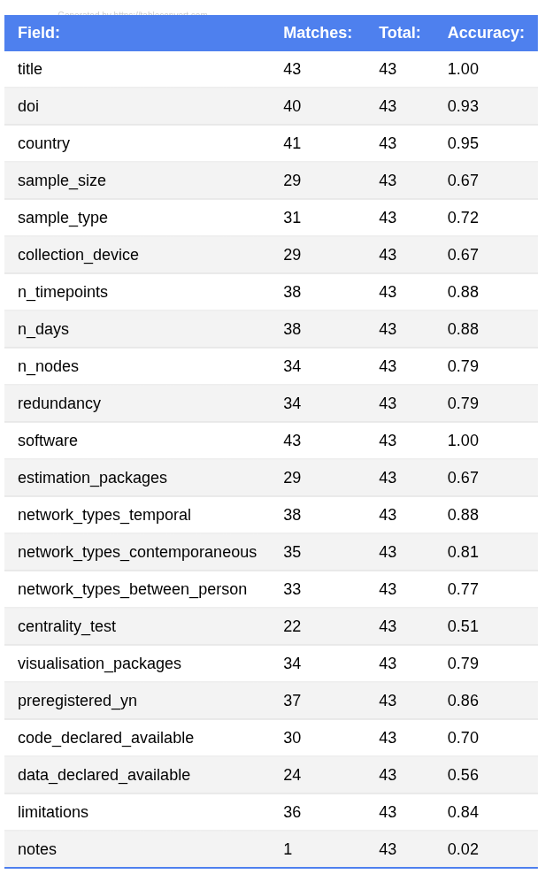
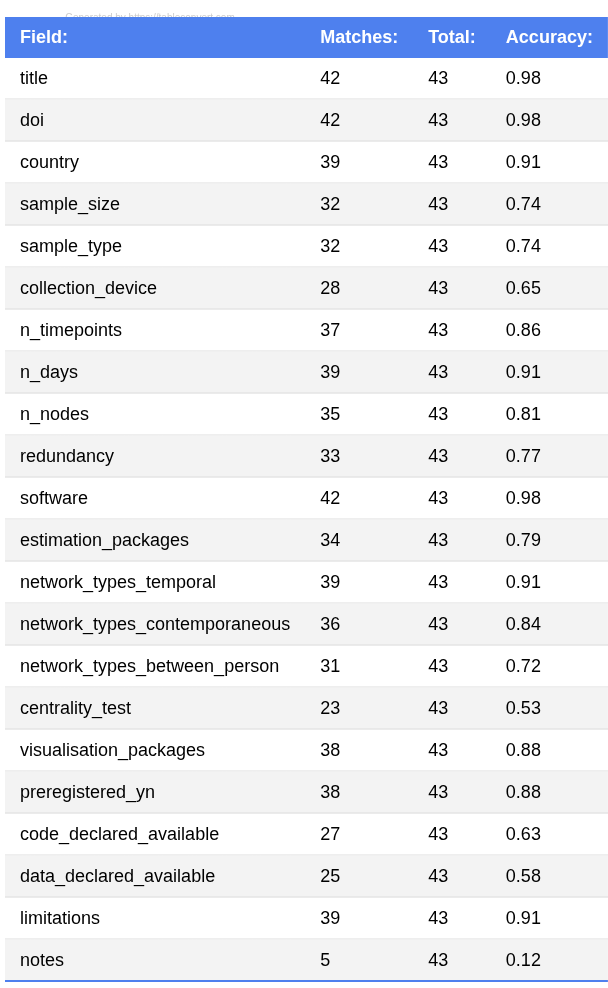

# Meta-Study Papers Analyzer

This project contains an implementation of the pipeline described in the paper 
"Automating Data Extraction in Meta-Research: A Multi-Model Benchmark and Reproducible API Pipeline".

The project consists of the following parts:
1. OCR - conversion of the PDF documents to Markdown format
2. Data Extraction - structured list of variable per paper
3. Evaluation - comparison of the extracted data against the ground truth 

## Installation

### Prerequisites

Before installing, make sure you have LM Studio installed and running (either GUI or daemon mode). 
For more information visit [LM Studio Developer Docs]("https://lmstudio.ai/docs/developer").

### Project Setup

Create a conda environment and install project requirements:

```bash
conda create -n mepsai python=3.12 && conda activate mepsai
pip install -r requirements.txt
```

### LM Studio Setup

Install LM Studio Python SDK:

```bash
pip install lmstudio
```

Make sure LM Studio is running

Either the GUI app or via CLI:

```bash
lms daemon up
lms server start
```

- LM Studio requires the LM Studio application to be running (GUI or daemon)
- The model name format may differ from Hugging-Face (e.g., "qwen3-vl:8b" vs "qwen/qwen3-vl-8b")
- LM Studio has better built-in support for tool calling with compatible models


## How to Use

1. Prepare your documents (PDF, images, etc.) in the `documents/` directory.
2. Convert documents (PDF, images, etc.) to Markdown format using LightOnOcr.
```bash
python ocr.py
```

3. Run the main script:

```bash
python main.py
```

4. The script will process each document transcript:
   - Text files in `documents/txt/`
   - Markdown files in `documents/md/`
   - Evaluation results in `documents/md/mismatches_local.csv` and `documents/txt/mismatches_internet.csv`

## Results

The results of the analysis are stored as images in the following folders:

- `documents/md/` - Contains Markdown-formatted results for local processing
- `documents/txt/` - Contains text-based results for internet-based processing

### Sample Results

The following images show sample results from the analysis:

**Text transcript results - local:**

**Text transcript results - with internet search:**

**Markdown transcript results - local:**

## Evaluation

The evaluation process compares extracted data against ground truth data in two steps:
* Semantic similarity of pair embeddings - low computational cost over large amount of data   
* LLM prompting (Qwen3-vl-8b Q8) for more profound similarity estimation of found mismatches 

Resulting mismatches are stored in:

- `documents/txt/mismatches_local.csv` - Local processing mismatches in TXT transcripts
- `documents/txt/mismatches_internet.csv` - Internet-based processing mismatches in TXT transcripts
- `documents/md/mismatches_local.csv` - Local processing mismatches in Markdown transcripts

These files can be used for the manual analysis of the results as they still might contain pairs falsely flagged as mismatches. 
## Troubleshooting

- If you encounter issues with LM Studio, ensure it's running properly
- Check that the model names match the format expected by LM Studio
- Verify that all required dependencies are installed
